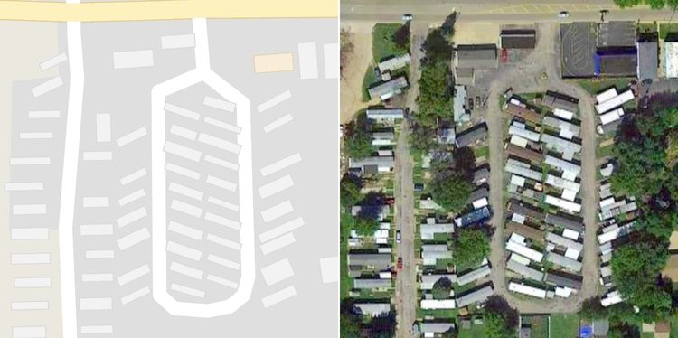
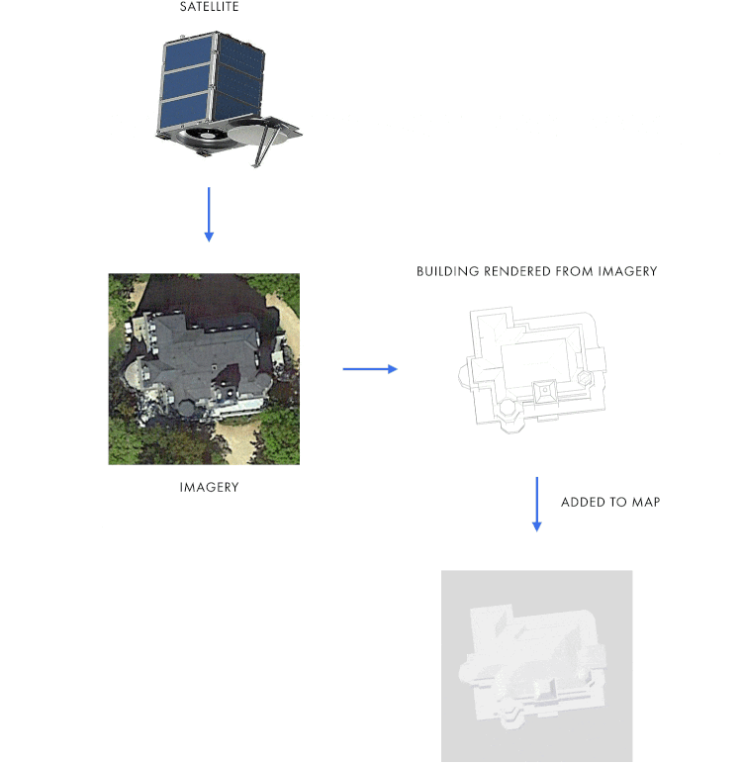
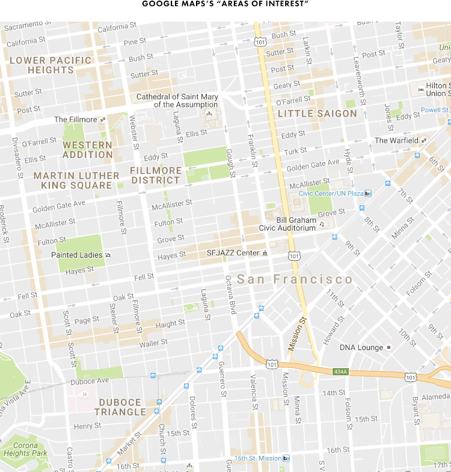
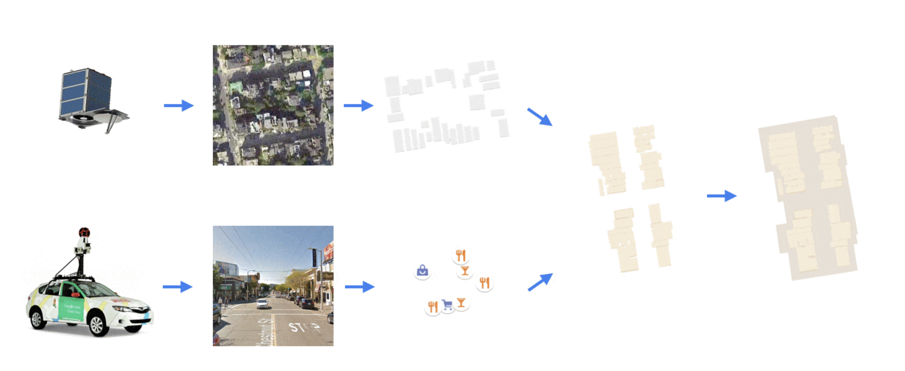
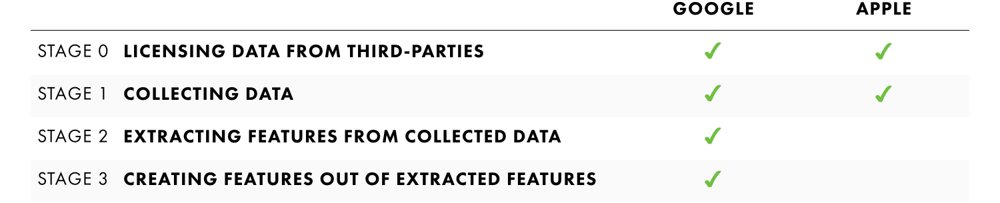

Title: グーグルマップの城壁—データからデータを作り出すAI戦略
Date: 2019-03-22 00:00
Category: Machine Learning
slug: google-maps-moat
Cover: images/google-map-aoi.png

グーグルマップが、[ゼンリンから自社独自のデータに切り替えたことによるクオリティの低下](https://japanese.engadget.com/2019/03/22/google/)が話題になっていますが、グーグルマップが何年も前から、衛星写真やストリートビューなどのデータから、機械学習の手法を駆使して地図データをすごい勢いで充実させていることはあまり知られていません。

Google や Apple の地図サービスなどの事情に詳しい Justin O'Beirne 氏による[「グーグルマップの城壁」](https://www.justinobeirne.com/google-maps-moat)と題されたこの記事では、Google がいかに画像認識と機械学習の技術を駆使し、「データからデータを作り出す」ことに成功し、自社サービスに他社が追いつけないような「城壁」を築くのに成功したか、ということが書かれています。

個人的な話ですが、最近、[機械学習エンジニアとして独立して](http://masatohagiwara.net/leaving-startup-and-becoming-independent.html)から、主にスタートアップ等を対象に、人工知能・機械学習系のプロジェクト戦略についてコンサルティングをしています。特に、機械学習やデータが鍵となるサービスでは、いかにデータを収集し、機械学習の技術を活用しながら新たなデータを生み出したり、競合が追いつけない勢いでプロダクトを改善するか、ということが非常に大切になってきます。その戦略を考える上でも、非常に示唆に富む記事になっています。

以下、本記事のまとめです。なお、グーグルマップに関する他の記事を見ていると、例えば Android 上のユーザーの位置情報なども使って、道路の情報を改善していると思われる箇所があるそうです。本記事に書かれた内容以外にも、利用できる様々なデータを使ってグーグルマップを改善していると思われます。

---

## 地図に表示されたトラック

Apple など他の地図サービスと、グーグルマップを比較してすぐ気がつくのは、建物の充実度である。本記事の執筆の２〜３年前にはまだこれらの建物は表示されていなかったことから、2016年〜2017年にかけて徐々に追加されていったということが分かる。

しかし、グーグルマップに表示されているのは、実は民家や商業ビルなどの単なる「建物」だけではないことが分かる。公園の小屋や、なんと駐車してあるトラックなどまでが含まれているからだ。

<figure style="text-align: center">
	
	<figcaption>地図に表示された駐車してあるトラック</figcaption>
</figure>

他にも、例えば教会の玄関の階段や、高層ビルの屋上のエアコンの室外機までもが地図に表示されている。数十人〜数百人しか住民が居ないような小さな「村」でも、全ての民家・商業施設の形が地図から見てとれる。それと比べて、Apple の地図は、シカゴやロサンゼルス、ニューヨークなど大都市にさえ、建物が全然表示されていないようなところもある。

## データから3Dモデルを作り出す

グーグルマップに建物の 3D モデルが表示され始めたのは、2007年の時点だ。ただ、今のものと比べると、非常に限定された範囲であり、クオリティも全く劣る。しかし 2012年に Google は、詳細な建物の 3D モデルが表示されるエリアの範囲を大幅に拡張したことを[アナウンス](https://maps.googleblog.com/2012/10/expanded-coverage-of-building.html)した。その記事の中で、それらをどのようにして作っているかも明らかにしている：

> これらの建物のモデルは、高さの詳細な情報も含め、航空写真を撮影し、画像認識の技術を使って建物の形を作ることでアルゴリズムによって作られています。

ということで、Google は地図に表示されている建築物の形を、航空・衛星写真から作り出して、地図に追加しているのだ。

<figure style="text-align: center">
	
	<figcaption>航空・衛星写真から建物の形を作り出す</figcaption>
</figure>

しかも、驚くべきはその追加の速さである。追加が始まって2年も経たないうちに、アメリカの半分以上の建物の追加が終わっていた。これは、10年以上かかっているストリートビューに比べると驚異的である。

## 「見どころエリア」情報

サンフランシスコなどの大都市はおろか、どのような規模の都市でも、レストランや商店が集まっているような「商店街」的な通りがある。特に旅行などで街を訪れた場合、そのような情報は重要であるが、近年まで、グーグルマップであっても、オンラインの地図サービスを使ってそのような場所を知ることは難しかった。地図を見ても、通りと区画が表示されるだけで、どの通りに商店街のような場所があるかどうかが分からないのだ。

地図を使ってこの問題を視覚的に解決するのは難しい。商店名などのラベルを追加しようとすると地図上に表示される情報が多くなりすぎてしまう。また、ラベルが近くなりすぎると、どのラベルがどのランドマークに対応するかを見分けるのが難しくなってしまう。地図の縮尺に応じて、地域の名前や、通りの名前などを取捨選択して表示しなければならない。

この問題を、Google はどのように解決したのだろうか。

グーグルマップを良く見ると、都市の中心部など、建物などが周りの地域に比べて密集している部分は、少し濃い灰色で表示されていることが分かる。これと同様に、商店街など、レストランや商店が集まっている場所「見どころエリア」の情報を、オレンジ色に着色することによって表現し始めたのだ。

<figure style="text-align: center">
	
	<figcaption>地図にオレンジで表示された「見どころエリア」</figcaption>
</figure>

このように、「見どころエリア」情報の見られる都市は、サンフランシスコなどの大都市に限った話ではない。筆者の出身地のような小さな町まで、世界中の何千もの都市に対して、この「見どころエリア」を追加したのだ。

一点確かなのは、グーグルマップは、レストランや飲み屋、商店などの情報を使って、この「見どころエリア」を決めているようだ。ただ、どうもそれだけではない。良く見ると、この「見どころエリア」は、いびつな形をしているところがある。縮尺を調整して良く見てみると、なんとこの「見どころエリア」のいびつな形は、上で見た「建築物」の形と一致しているのである。

<figure style="text-align: center">
	
	<figcaption>「見どころエリア」の元となるオレンジ色の建物</figcaption>
</figure>

つまり、グーグルマップは、レストランや商店などを含んでいる建物をオレンジ色に着色し、そのオレンジ色の建物が集まっているところを、「見どころエリア」としているのである。

## 副産物の副産物

ここで面白いのは、この「見どころエリア」の元となった建物も、元はといえば、航空・衛星写真から副産物として生成されたものだということだ。

また、[前にも書いたように](https://www.justinobeirne.com/a-year-of-google-maps-and-apple-maps)、Google は、画像認識と機械学習の技術を使って、ストリートビューの画像から、商店などの名前や場所を抽出しているということだ。つまり、「見どころエリア」の元となったレストランや商店などの場所も、元はといえば、ストリートビューの副産物ということになる。

<figure style="text-align: center">
	
	<figcaption>副産物の副産物としての見どころエリア</figcaption>
</figure>

以上をまとめると、なんと、この「見どころエリア」は、それぞれ航空・衛星写真とストリートビューの副産物としての建物と商店の位置情報から、さらに副産物として生成されたものだということになる。

Google は、データからデータを作り出しているのだ。

## グーグルマップの城壁

さて、Apple が自社の地図に同じような変更をすることは可能であろうか。グーグルマップの「見どころエリア」情報は、収集したものではなく、他のデータから生成されたものだ。一方で、Apple には、同じ量と質・スケールで見どころエリアを作るための「材料」が欠如している。

グーグルマップが「見どころエリア」を追加し始める４年前には、航空・衛星写真からの建築物の抽出と、3D モデルの再現に取り組んでいたのである。しかし、Apple の方は、航空・衛星写真という同じデータを所有しながらも、画像から建築物の抽出という作業はしておらず、その結果、地図に現れる情報には、歴然とした差が生まれている。

また、見どころエリアのもう一つの材料であるストリートビューの画像についても、なんと 800億枚もの画像を解析し、商店の場所などの情報を抽出しているのだ。これによって、例えば同じ住所のビルに複数の店が並んで入っているような複雑な例でも、グーグルマップでは、それぞれの店の正確な位置が地図上に反映されている。一方、Apple の地図上では一つの場所にまとめられてしまっている。

Apple も、2015年ごろになってミニバンを走らせ、街の画像情報の収集を始めているが、その時点で、2008年から同様の画像情報の収集を始めた Google との間には、実に6年もの開きが出てしまっていたのだ。

<figure style="text-align: center">
	
	<figcaption>Google vs Apple の各ステージ</figcaption>
</figure>

Google が先行して、様々な分野で、大量のデータを集めたので、今度はそのデータを処理・加工し、Apple がとても追いつけないような機能を地図に付けているのである。これが、グーグルマップの「城壁」である。

