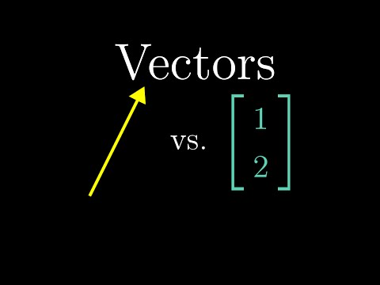

Title: 教科書より分かりやすい！数学を動画で学ぶ英語YouTubeチャネル 3Blue1Brown がオススメ
Date: 2019-01-24 00:00
Category: Math
slug: learn-basic-math-on-3blue1brown-youtube-channel
Cover: images/3blue1brown.jpg

「どの教科書より圧倒的に分かりやすい」

「なんでもっと早くこれを知らなかったのか」

「全ての数学のコースで必修にすべき！」

と、絶賛の声でコメント欄が溢れる、人気 YouTube チャンネル、「[3Blue1Brown](https://www.youtube.com/channel/UCYO_jab_esuFRV4b17AJtAw)」をご存知でしょうか？

スタンフォード大数学科卒の Grant Sanderson 氏によって作成・公開されている、数学の基礎的な概念をたいへん分かりやすいビジュアルと共に解説する動画シリーズです。

全ての動画が、数学の概念を「直感的に理解」することを目標に作られているので、数学が苦手な人はもちろん、概念や定理などを一通り学んだことがある人が見ても、「こういう事だったのか」と目からウロコなのは間違いありません。

例えば、「線形代数の基本」と題された動画シリーズの初回「ベクトルとは何か」では、ベクトルという概念がこのように紹介されています：

<iframe width="560" height="315" src="https://www.youtube.com/embed/fNk_zzaMoSs" frameborder="0" allow="accelerometer; autoplay; encrypted-media; gyroscope; picture-in-picture" allowfullscreen></iframe>

他にも「線形変換と行列」と題されたこの動画では、行列の掛け算はそもそも何をするものなのか、なぜその形になるのかを、直感的に解説しています：

<iframe width="560" height="315" src="https://www.youtube.com/embed/kYB8IZa5AuE" frameborder="0" allow="accelerometer; autoplay; encrypted-media; gyroscope; picture-in-picture" allowfullscreen></iframe>

「線形代数の基本」シリーズの全ての動画は、[こちら](https://www.youtube.com/playlist?list=PLZHQObOWTQDPD3MizzM2xVFitgF8hE_ab)から全て見ることができます。また、同様に[「微積分学の基礎」シリーズ](https://www.youtube.com/playlist?list=PLZHQObOWTQDMsr9K-rj53DwVRMYO3t5Yr)もあります。

動画には、全て英語字幕が付いているので（残念ながら日本語字幕はありませんが）、聞き取れないところも字幕で確認しながら学習を進めることができます。

個人的にオススメなのが、この[「ニューラル・ネットワーク」のシリーズ](https://www.youtube.com/playlist?list=PLZHQObOWTQDNU6R1_67000Dx_ZCJB-3pi)。この初回の「ニューラル・ネットワークとは何か」と題されたビデオでは、順伝播型ニューラル・ネットワークが、数字を認識する仕組みを分かりやすく可視化して解説しています：

<iframe width="560" height="315" src="https://www.youtube.com/embed/aircAruvnKk" frameborder="0" allow="accelerometer; autoplay; encrypted-media; gyroscope; picture-in-picture" allowfullscreen></iframe>

また、こちらのビデオ「誤差逆伝播法とは実際何なのか」では、誤差逆伝播法を分かりやすく解説しています：

<iframe width="560" height="315" src="https://www.youtube.com/embed/Ilg3gGewQ5U" frameborder="0" allow="accelerometer; autoplay; encrypted-media; gyroscope; picture-in-picture" allowfullscreen></iframe>

このチャンネルには、数学の他のコンセプトや、なんと物理の基本的な概念についても、解説する動画が多く上がっています。個人的に感動したのが、この フーリエ変換のビデオ。講義などで習ったこともあり、日常でもよく利用している概念ですが、こんなに分かりやすい解説を見たのは初めてです：

<iframe width="560" height="315" src="https://www.youtube.com/embed/spUNpyF58BY" frameborder="0" allow="accelerometer; autoplay; encrypted-media; gyroscope; picture-in-picture" allowfullscreen></iframe>

なお、Grant 氏は、スタンフォード大学卒業後、Khan Academy でコンテンツ作成に携わった後、現在ではフルタイムで 3Blue1Brown の動画制作にコミットしているそう。見やすく綺麗なビジュアルは、自身で作成した [manim](https://github.com/3b1b/manim) というオープンソースのアニメーションエンジンで作られています。「3Blue1Brown」という名前は、Grant氏の目の色から来ているそうです。
