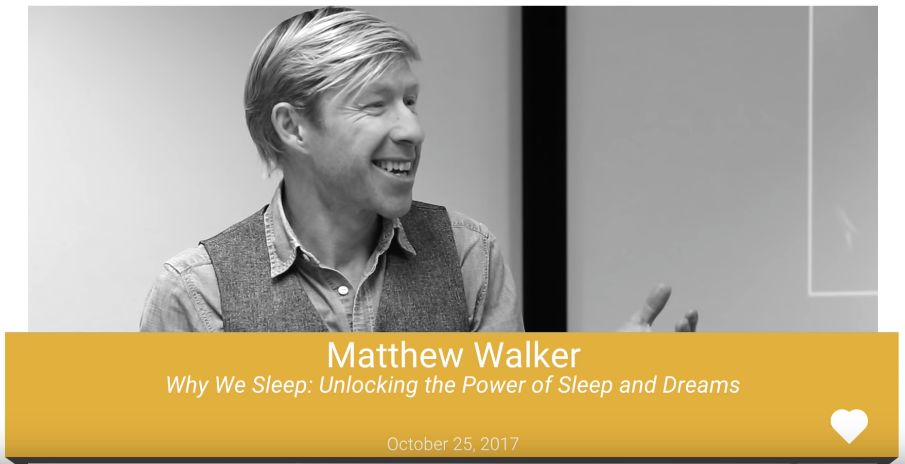

Title: ベストセラー「睡眠こそ最強の解決策である」著者マシュー・ウォーカー氏による Google 最新講演
Date: 2018-07-27 00:00
Category: Productivity
tags: Productivity, Self Improvement, Science
slug: matthew-walker-why-we-sleep-google-talk

「自分は睡眠が少なくても大丈夫」と思っている人は、「ぜんぜん酔ってないから」と言いながら車を運転して帰ろうとする酔っぱらいぐらい危険である。

アメリカ・イギリスでベストセラーとなった「睡眠こそ最強の解決策である」の著者であり、睡眠研究の世界的第一人者であるマシュー・ウォーカー氏の主張は一貫しています。本書は、日本でも少し話題になったので、聞いたことのある方も少なからず居るのではないでしょうか。私も書籍を英語で全て読みましたが、評判どおり「これまでの考え方と人生を根本的に変えてしまうスゴ本」で、事あるごとに人にオススメしています。

Center for Human Sleep Science （人類睡眠科学センター）創始者・所長でもある著者のマシュー・ウォーカー氏が、 Google で講演したビデオがありましたので、まとめてみました。書籍を全て読むのは時間がかかりますが、本トークであれば要点が３０分程度で把握できるので、時間の無い方、要点だけをざっと掴みたい方にオススメです。

少し難し目の医学系・生物系の用語も出てきますが、ウォーカー氏の話し方もゆっくりで、字幕もついているので、割と簡単に理解できるでしょう。

[講演ビデオはこちら](https://www.youtube.com/watch?v=aXflBZXAucQ)

- 生殖器
	- ５時間しか寝ない男性は、もっと寝る男性に比べて睾丸が小さい
	- 女性の生殖能力についても同じ

- 記憶
	- 学習した後で、記憶に「保存」するには、睡眠が必要。学習の前にも、脳を「準備」するために睡眠が必要。
	- 徹夜すると、８時間十分に睡眠したグループに比べ、学習の効率が４０％も落ちる
	- 海馬＝脳の「受信トレイ」　睡眠不足になると、海馬の活動が無くなり、新しいことを覚えられなくなる。
	- 睡眠紡錘波 (sleep spindles) 「ファイルの転送」学習したことを長期記憶（大脳新皮質）に運ぶ
		- 覚えたことを長期記憶に保存するので、忘れにくい
		- ファイルを短期記憶から削除したので、新しいことを覚えられる

- 医療
	- 加齢に伴い、学習・記憶能力が低下する。同時に、(特に深い)眠りの質も低下する。この２つには相関以上の関係がある可能性
	- 深い眠りの欠乏が、加齢に伴う認知症、アルツハイマー病になる可能性を高める
	- 良いニュース：眠りであれば、対処できる可能性がある
	- 睡眠薬は、自然な眠りを作り出さない。ガンや死亡する率を高める
	- ウォーカー氏のアプローチ：微弱な電流を使い脳を刺激。脳の記憶効率を上げる。加齢に伴う記憶力低下に効果があるか？自分で試さないこと！

- 教育
	- アメリカでの学校の始業時間について。7:25 に学校に着く場合、スクールバスは早い場合 5:30 に出発。
	- ミネソタ州イーダイナ市 → 7:25 から 8:30 へ始業時間を遅らせた。SAT のトップ10% スコアが、1250 から 1500 へ改善。
	- 睡眠の改善によって、学業成績が改善、問題行動・無断欠席・精神病問題が低下
	- 生徒の平均寿命も増加。この年齢の死亡原因ナンバーワンである運転中の交通事故が激減
	- ワイオミング州のティトン → 7:35 から 8:55 へ始業時間を遅らせ、交通事故数が 70% 減少
	- 教育における睡眠の重要性を見直す時が来ている

- 感情
	- 睡眠不足になると、感情が不安定になる
	- 睡眠不足の被検者の例（ビデオ）
	- 扁桃体 (amygdala) 感情的な反応を作り出す。睡眠不足は、扁桃体の反応性を 60% 高める
	- 様々な精神病の状態と類似。睡眠は重大な精神病に重要な関係がある

- 身体
	- 他の体の様々なシステムと睡眠にも深い関係がある
	- １週間、睡眠不足になると、糖尿病予備群と診断されるほど、血糖値が混乱される
	- 70カ国、16億人の人を対象にした「実験」→夏時間。
		- 春に１時間睡眠時間が減ると、心臓発作の危険性が 24% 増加
		- 秋に１時間睡眠時間が増えると、逆に 21% 減少
	- 免疫システム：ナチュラルキラー細胞 (NK細胞)。がん細胞を破壊する
	- 人間の体は、つねにがん細胞を作り出している。これらががんに発達するのを防ぐのがNK細胞
	- 一晩、４時間しか寝ないと、NK細胞の活動が 70% も低下
	- 短い睡眠と、様々な種類のがんとは因果関係がある。WHO は、夜勤の仕事を「可能性の高い発がん因子」に分類
	- 睡眠が足りないと、寿命が短くなり、残った寿命のクオリティも下がる
	- がんと闘病中で、睡眠が足らない場合、がんはもっと早く成長する
	- マウスでの実験。がん細胞を移植し、１ヶ月間、睡眠を制限すると、腫瘍サイズ・成長スピードが3倍になる。転移も観察
	- DNA 遺伝子
		- １週間、睡眠を6時間に制限すると、711個の遺伝子に異変。(アメリカ人の約半分が、平日6時間以下しか寝ない)
		- 免疫に関する遺伝子の活動が低下、腫瘍・炎症、ストレスなどに関する遺伝子の活動が活発に
	- 「遺伝子組み換え食品」には反対するのに、睡眠不足によって自分に対して「遺伝子組み換え実験」をしている
	- 家の壊れた水道管のように、睡眠不足による悪影響は体のあちこちに浸透する

- まとめ
	- 睡眠は「贅沢」ではない
	- 睡眠は、生物学的に譲れない必需品。生命維持装置。
	- 睡眠不足は、先進国に広がる伝染病のようなもの。21世紀における大きな社会健康問題の一つ
	- 「怠けている」と汚名を着せられないように、十分に睡眠を取れる社会の実現を。

|            英語        |        日本語       |
----------------------- | --------------------
| testicle              | 睾丸               |
| virility              | 生殖能力           |
| impairment            | 障害・機能低下      |
| pull the all-nighter   | 徹夜をする        |
| deprivation           | 奪うこと、欠乏      |
| shuteye               | 睡眠              |
| ace                   | v. 高得点を取る     |
| parenthetically       | ちなみに           |
| symbiotic             | 共生の             |
| silver lining         | 不幸中の幸い、明るい兆し |
| truancy               | 無断欠席           |
| life expectancy       | 平均寿命           |
| incessant             | 絶え間ない          |
| affable               | 親しみやすい         |
| psychiatric           | 精神病の            |
| delusional            | 思い違い            |
| profanity             | 口汚い言葉          |
| lucid                 | 正気の             |
| hilarious             | とてもおかしい       |
| tumor                 | 腫瘍               |
| metastasize           | 転移               |
| mortality             | 死亡率             |
| erode                 | 侵食する           |
| expression            | (遺伝子の)発現      |
| inflict               | 与える、傷などを負わせる |
| unscathed             | 無傷の             |
| nook and cranny       | ありとあらゆる場所    |
| tamper                | 改ざんする           |
| decimation            | 大量破壊            |

