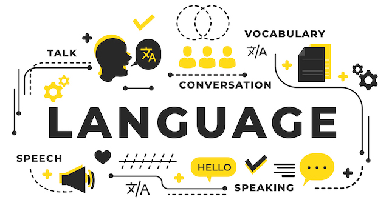
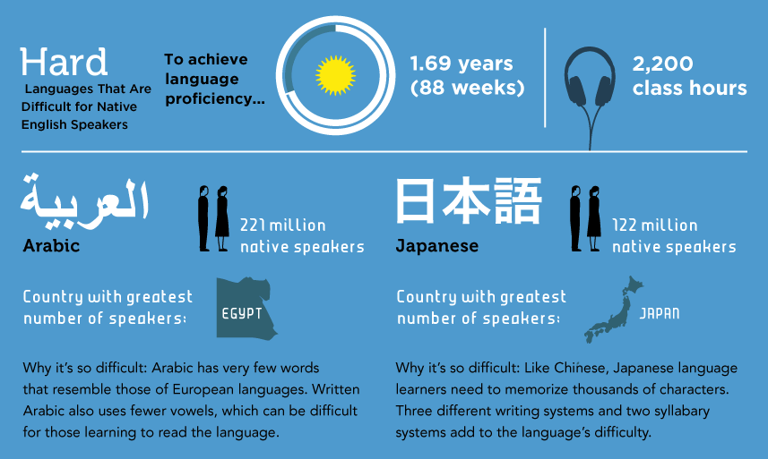

Title: あなたはなぜ英語ができないのか — プロジェクトベース英語学習法のススメ
Date: 2019-04-12 00:00
Category: English Learning
slug: project-based-english-learning
Cover: 

目次

- [はじめに](#intro)
- [巷の英語教材のウソ](#learning-materials)
- [あたなの周りの人は、英語が話せますか？](#5-neighbors)
- [あなたが英語ができない理由](#3-reasons)
    - [理由1: 日本語と英語が違いすぎる](#reason1)
    - [理由2: 時間がかかる](#reason2)
  	- [理由3: 必要がない](#reason3)  
- [「私はこうして英語がペラペラになった」](#how-to-be-fluent)
- [TOEIC はどうなの](#toeic)
- [環境をハックする](#principles)
- [具体的にどうすればよいのか](#methods)
    - [自分の好きな教材を使う](#favorite-materials)
    - [オススメの教材](#recommended-materials)
    - [オススメしない教材](#not-recommended-materials) 
  
突然ですが、皆さん、ピアノは上手ですか？「弾けない」と答えた方、でも、義務教育（小学や中学）で、「音楽」の時間がありましたよね。そこで、何らかの鍵盤楽器を練習した方も多いと思います。なぜ上手ではないんでしょう。

サッカー、ならどうでしょう。水泳、でも良いです。「上手でない」と答えた方、でも、義務教育の体育の時間で、サッカーや水泳をいくらか練習した方も多いと思います。なぜ上手ではないんでしょうか。

**「練習の量が絶対的に足りない」** からです。当たり前ですよね。

このガイドは、この「当たり前」のことを「英語」に対して応用したものです。ピアノやサッカーであれば、「練習していないのだから上手ではないのは当たり前」ということに異論を唱える人は少ないのですが、英語になると「義務教育で小中高と何年も勉強してきたのに話せないのはおかしい」という意見が多いのは少しおかしな気がします。

**あなたが英語ができないのは、学習方法や教材が悪いからでも、学校教育や先生が悪かったからでもありません。** 平均的な日本人が英語ができないのは、もっと根本的な複数の要素が絡み合っています。

その要素を「ハック」することによって、あなたの英語は今よりもずっと上達します。このガイドでは、そのお手伝いができればと思っています。

## はじめに

このガイドは、これまで、英語を含む色々な外国語の学習に成功そして挫折してきた私の個人的な経験と、数え切れない人に英語学習のアドバイスをしてきた私の経験に基づいて、英語学習を継続させ、成功させるためのポイントをまとめたものです。メインのメッセージは、**「言語はツールである。必要になる状況を故意に作り出すことが成功の秘訣だ」** ということに尽きます。

このガイドのメインの想定読者は、以下のような方です。

* 学校で習った基本的な挨拶や文法は覚えていてある程度分かるが、英語力が長期的に伸び悩んでいる。特に、スピーキングが苦手
* 学業や仕事、趣味なので英語を学ぶ必要があるのは理解しているが、英語の学習が続かない

このような方の英語学習のお役に立てればと思っています。

逆に、

1. 中学英語で習うような初歩的な文法が分からない
1. 海外出張・赴任するので３ヶ月以内になるべく早く英語力を向上させたい

という方は、対象ではありません。１番目に当てはまる方は、中学・高校の英語の簡単な復習ができる良い教材が日本では数多く販売されているので、そういったものから復習することをオススメします。また、２番めの方については、残念ながら本ガイドを読むだけで３ヶ月程度で英語力を劇的に向上させることは難しいかもしれません。ただ、出張・赴任された後でも、きっと、長期的に渡る英語学習の助けにはなるでしょう。

ちなみに、このガイドを読むこと自体では、英語力は全く向上しません。しかし、後で述べるように、英語の学習は長期戦です。何千時間もかかります。このガイドを読むには、数十分とかかりません。この数十分で、後に何千時間の学習を楽に進められるのなら、その学習の効率が大幅に向上するなら、良い投資だと思います。

なお、ここでは「英語学習」に限定して話を進めていますが、他の言語、フランス語、スペイン語、中国語、韓国語などにもそのまま当てはまるアドバイスがほとんどですので、そのような言語を学習されている方にも有用でしょう。

## 巷の英語教材のウソ

日本では、英語学習が一大産業を形成しています。書店に行けば英語の学習書が大きなスペースを占め、英会話教室も乱立しており、そういった教材等の広告をいたるところで目にします。英語学習を題材にしたブログ等も多いですよね。

そういった広告などでよく目にするフレーズが、「日本に居ながら英語が上達する」です。「駅前留学」というフレーズで積極的に宣伝していた英会話学校もありましたね。

確かに、日本に居ながら英語を上達させることは可能です。でも、こういったフレーズで触れ込みの英会話学校に通ったり、教材を使ったりするだけで、英語が上級レベルまで到達した人を私は知りません。私も、日本に居たときは、こういった教材や英会話学校に何十万円もお金を使いましたが、全然効果がありませんでした。

ここに、英語教材や英会話学校の巧妙な戦略があります。巷にあふれるほとんどの英語教材や英会話学校は、**「買ってもらって終わり」** です。書籍などは、買ってもらった時点で販売元にお金が入るので、その後、その教材を使った人がどのぐらい英語が上達したか、ということには関心がありません。英会話学校も、入学時に授業を何ヶ月分も、何十万円以上も前払いするのが普通なので、その後、生徒の英語がどのぐらい向上したかについては関心があまりありません。また、そもそも日本にある英会話学校は、生徒に海外に行かれてしまうと、日本でお金を落としてくれないばかりか、その方がはるかに効率的であることを知られてしまうため、海外に行く必要がないことを強調するのです。

このように、ほとんどの語学ビジネスと、学習者との利益は一致していないのです。

当たり前のことですが、繰り返します。**英語を学ぶには、英語が話されている国に短期でも良いので行くのがいちばん効率的です。** 日本では英語学習が一大産業を形成しているため、こんな基本的な事実さえも消費者に歪んで伝わっていることに気が付くべきです。

## あたなの周りの人は、英語が話せますか？

ここで、あなたと最も近い5人の人を思い浮かべてください。家族・友人・会社の上司・同僚・近所の人、色々と居ると思います。

その5人の人は、英語ができますか？ その5人の人の英語力を平均してみてください。おそらく、あたなの英語力とかなり近いのではないでしょうか。

**「人は周りの5人の平均になる」** ということがよく言われています。これは、生活習慣や年収に至るまで、色んなところで成り立つことが示されています。 ** 英語も、例外ではありません。** 特に英語は、周りの人と直接使うものなので、この現象がよく成り立つのではと思います。周りの人が英語ができないのに、あなただけ英語ができることを期待するのは、少し無理があるような気がしますよね。

ちなみに、上で、英語力を向上させるためには、短期でもいいので海外に行くのがいちばん効率的であるということを書きました。この「周りの5人」の英語力を向上させる一番手っ取り早い方法が、「海外に行く」ことなのです。近所の人が英語を話していたら、自分も英語が上達する可能性はぐっと高まります。

ここでよくある反論は「ただ、海外に行っても英語ができるようになるとは限らない」というものです。確かに、何年もアメリカに住みながらも、依然として日本人発音のつたない英語を話し続けている方。チャイナタウンなどの中華系コミュニティですべて事足りてしまうため、英語が全然話せないままアメリカに何十年も住んでいる中華系の方々。フィリピンのセブ島に英語留学に行っても、基本的に日本人とばかりつるんで、結局英語力が全然上達しない人。様々な方を見てきました。

そのようなケースは、すべてこの「周りの5人の平均」で説明がつきます。日本から赴任して海外にやってきた方も、家族はもちろん日本人、日本人の多く住むアパートに住み、仕事上でも日本人との日本語のやりとりがメイン、休日は日本人の友人と付き合う、といったように、周りの5人の英語力が低いままの人がけっこういます。セブ島に留学して日本人とばかり話している人も同じです。

こうした場合、海外に何年居ようとも、「周りの5人問題」を解決しない限り、英語力の向上は望めないのです。

## あなたが英語ができない理由

ここで、典型的な日本人が、なぜ英語ができないか、という理由をまず整理してみましょう。

### 理由1: 日本語と英語が違いすぎる

まず、一番大きな理由は、** 日本語と英語が違いすぎるからです。** 文字も単語も発音も文法も文化も何もかも違います。英語で多くの人がつまづく冠詞・前置詞・複数形など、すべて日本語にありません。語順も、日本語を英語に訳すとまったく逆になることが多いですよね。

人間が外国語を勉強する際には、この母語の影響というのが非常に大きいことが知られています。日本語と英語が違いすぎるので、そもそも英語を勉強することが非常に大変なのです。

これは、この逆のパターンを観察してみると分かります。日本にも数多くの外国人が訪問・移住して来ているわけですが、その外国人の中の日本語の習得度を比べてみると、英語などヨーロッパ系の言語を母語とする人に比べ、中国語や韓国語など、東アジア系の言語を母語とする人の方が圧倒的に早いのです。中国語は日本語と非常に似た漢字を使いますし、韓国語の文法は日本語と非常に似ています。両者とも、日本語と似た漢語由来の語彙が非常に多くあります。これらの言語と日本語の「距離」が近いので、東アジア出身の外国人は日本語の習得が早いのです。

あなたの周りの日本語の上手な外国人を思い浮かべてみてください。中国・韓国など東アジア出身者が多くないですか？　

この理由は、日本語を母語として生まれた以上、どうしようもないものです。ただ、私は、この記事で述べる3つの理由の中で、この理由が一番些細なものだと思っています。

なぜかというと、例えばアメリカにはスペイン語を外国語として学んだことのある人が多いのですが、アメリカ人の平均的なスペイン語力は、スペイン語を学んだことのある人でも、恐ろしく低いというのが個人的な観察です。レストランで注文できれば上出来といったところです。英語とスペイン語は文法や単語などが非常に似ているのにもかかわらず、なぜこういうことが起こるのか。それは、以下に述べるもう２つの理由が大きいからです。

### 理由2: 時間がかかる

２つ目の理由は、そもそも外国語が上達するには時間がかかる、というものです。アメリカの外交官などを育成する [Foreign Service Institute](https://www.effectivelanguagelearning.com/language-guide/language-difficulty) という組織が、外国語の難易度ランキングと、その外国語を実用的に使いこなせるために必要な時間を公開しています。

このデータによると、日本語は、英語話者にとって、アラビア語・中国語・韓国語と並んで、最も難しいカテゴリに分類されています。日本語は、このカテゴリの中でも最も難しい言語として、**2200〜3000時間もの学習が必要だとされています**。このデータは、英語話者が日本語を学習する場合のものですが、その逆、日本語話者が英語を勉強する場合にも当てはめて良いでしょう。

一方で、学校教育で英語に触れる時間は1000時間程度だという見積もりがあります。つまり、学習時間が圧倒的に足りないのです。

(ソース：[What are the hardest languages to learn? Check the ranking](https://www.lingholic.com/hardest-languages-learn/))

英語の学習、というと、どういった教材を使うとか、どういった勉強法をするか、という、「効率」の部分につい焦点が当たる傾向があります。しかし、下のグラフで示したように、学習量は、「効率×時間」で表されます。いかに短期的に効率を追求しても、学習が続かなければ全く意味がありません。巷にあふれる多くの英語教材は、この「いかに学習を続けるか」ということに全く関心がありません。

2000時間もの学習量を確保するためには、1日1時間ずつ勉強しても、5年ほどかかります。

**「1日1時間ずつ勉強して、5年」**

これを少ないと見るか、気の遠くなるような時間と見るかは、人それぞれでしょう。ただ、**巷にあふれる「１ヶ月で英語がペラペラになる」系の教材は、たいていがウソです。** 繰り返しますが、巷にあふれるほとんどの教材は、商業的に成功するために、あなたが英語がうまくなる必要がないのです。そのようなものに騙されてはいけません。

さて、「1日1時間ずつ勉強して、5年」勉強しなければいけないという事実を受け入れたとしましょう。どんなに頑張っても、それだけの時間がかかるのです。逆に見ると、結局それだけの時間がかかるのであれば、楽をしたいというのが人間の性（さが）です。このガイドは、「いかに楽にこの2000時間を乗り越えるか」というガイドでもあります。

私の個人的な考え方ですが、英語学習は「ダイエット」にとても似ています。健康に、確実に痩せたいと思うのであれば、ある一定の期間、例えば一週間だけ一生懸命に運動して、がんばって断食して終わり、ではありません。このようなやり方では、確実にリバウンドします。長い期間に渡って健康的な生活習慣を継続することが必要になります。これは「生き方」そのものを変える仕組みづくりです。これは、一見、大変に見えるかもしれませんが、実は、「一週間だけ、一生懸命に運動して、断食する」よりもずっと楽なやり方です。なにしろ、最初からずっと続くと分かっているわけですから、いかに楽するか、いかにモチベーションを保つか、いかに続けるか、ということにフォーカスできます。これらが、英語学習に成功するための要素です。

ちなみに、日本語で「勉強」というと、机に座って本に向かってひたすら頑張っているイメージがあります。**実は、この残りの2000時間は、机に全く座らなくても達成ができます。** 詳しい方法は、後ほどのセクションで見ていくことにしましょう。

### 理由3: 必要がない

日本人が英語ができない最後にして最大の理由は、「必要がない」からです。** 日本に住んで主に日本人と生活している以上、英語ができなくてもあまり困らないのです。**

そもそも、あなたはなぜ英語ができるようになりたいのでしょうか。

* 外国人に道を聞かれた時にサッと英語で対応したい
* 仕事で外国人を英語で接待したい
* 好きな海外ドラマや映画を字幕無しで見たい
* 何となくカッコいい

といったところが出てくるかもしれません。

でも、これらって、本当に必要ですか？これらができなかったら、どのぐらい困りますか？

ここで、あなたの「英語力」と、その英語力が達成できたら「嬉しい度」の関係をグラフにしてみましょう。これを「モチベーション・グラフ」と呼ぶことにします。

これが、典型的な日本人のモチベーション・グラフです。「英語ができない＝嬉しさゼロ」からスタートして、英語力がだいぶ向上した右の段階で、少し上がっています。つまり、典型的な日本人にとって、英語力と嬉しさの関係は、英語ができなくても困らないが、できると少し嬉しい、という程度なのです。

これが、たとえばあなたが海外移住・留学・赴任するとどう変わるかを見てみましょう。海外に行くと、現地の言葉が分からないと、衣・食・住の全てにおいて困る場面が出てくるでしょう。日本企業の支社や、現地企業に勤務している場合、英語が分からないと業績の問題でクビになるかもしれません。留学している場合は、英語が分からないと落第になるかもしれません。

このような人のモチベーション・グラフは、以下のようになります：

つまり、英語ができないと、すごく困るわけです。英語がある程度できてやっと現地で生活できるので、その段階でやっと「嬉しさゼロ」になります。一方で、英語ができると、現地に馴染めたり、日本ではできないような体験、例えば、シリコンバレーで報酬の高い職に就くなどの可能性が広がるため、「嬉しさ」は一気に上ることになります。

英語の学習を長期的に成功させるためには、この **モチベーション・グラフをハックする** ことが必要不可欠です。人間は、「無くても困らないが、いつか役に立つかもしれない」ようなものには長い時間をかけて勉強できるモチベーションが出ないようになっています。

## 「私はこうして英語がペラペラになった」

上で述べたように、巷には「私はこうして英語がペラペラになった」という、「英語指南書」が溢れています。同じような内容のブログ記事をいくつか見たことのある方も居るのではないでしょうか。

こういった「私はこうして英語がペラペラになった」というストーリーをいくつも見てみると、ある決まったパターンがあるのに気が付きます。

ステップ１：全く英語のできなかった私。TOEICでも低い点数しか取れなかった。

ステップ２：海外赴任や留学などで、英語が必要になった。最初は、英語が全然分からなくて困った。

ステップ３：○○という教材に出会って勉強したら、英語力が上がった！

ステップ４：だからあなたも○○という教材を使うべき！

というパターンです。

ここで、ストーリーの詳細は「○○という教材」だったり、「○○という勉強法」だったり、「○○英会話学校」だったりと色々と変わるわけです。だから、あなたも「○○」を買うべき、というわけです。ステップ３〜４が大事だ、ということを強調します。

でも、こういうストーリーをいくつを見てみると、実は、全てのストーリーに共通して大切なのは、「ステップ２」なのです。**「英語が全然できなくて困った」という体験が、実はあなたの英語力を向上させるのです。**

こういったストーリーを経験した人にとっての「モチベーション・グラフ」は、上の２番目のグラフ（赤線）のようになっています。具体的な教材は、実はあまり重要ではないのです。モチベーション・グラフや、環境をハックしたことそのものが重要なのです。

## TOEIC はどうなの

ここで「自分は、仕事などで TOEIC が必要だから英語を勉強している」という声が聞こえてきそうです。実際、TOEIC が入学・就職・昇進などで必要だから英語を勉強しているという方も、大勢居るかもしれません。

TOEIC が必要になると、上の「モチベーション・グラフ」の形が変わります。点数が低いと入学・就職・昇進などで不利になるので、「嬉しくない」というわけですね。これだけ見ると、「英語力を上げるには、TOEIC の勉強をして良い点を取れば良い」という気がしてきます。

ただ、私は「TOEIC の勉強をがんばって続けたら、英語がペラペラになった」という人を一人も知りません。

TOEIC は、非常に良く設計されたテストですが、問題が２つあります。一つは、「簡単すぎる」ということです。外国人がアメリカなど英語圏に留学する際によく必要とされる TOEFL と比べて、TOEIC は非常に簡単です。「TOEICは、英語のできない韓国や日本などの東アジアの国のために設計された」という噂もあるぐらいで、満点を取っても、ネイティブレベルには及ばないレベルの英語力しか測れません。

もう一つの問題は、「スピーキングとライティングが無い」というものです。日本人の多くが受ける、いわゆる「TOEIC」と呼ばれているテストは、正式には「TOEIC Listening & Reading Test」といい、リスニングとリーディングの問題しかありません。聞く・読むという受動的な能力は、もちろん英語を使う上で非常に重要な能力なのですが、それだけでは、話したり書いたりといった「英語を使う」ことが本当にできるか、という能力は測れないのです。

この２つの問題から、「TOEIC の点は取れるのだけど、英語が実際に使えない」ということが起こるのです。これをグラフにしてみると、下の図のようになります。

多くの人の頭の中の「理想」では、左の図（青）のように、TOEIC の点と英語力の間には、強い相関があります。「TOEICの点を上げていったら、スムーズにネイティブレベルに達する」ということです。

ただ、現実は、TOEIC の点と「真の英語力」の間には、右の図（赤）のように、弱い相関しかありません。そもそも、「真の英語力を測定する」ということは、どんなテストを使っても難しいものですが、スピーキングとライティングが無い TOEIC においてはなおさらです。しかも、テストが簡単なので、点数のレンジが狭く、満点を取ったとしてもネイティブレベルの英語力の保証は全くありません。

ここまで、TOEIC の悪口とも思えることをつらつら書きましたが、実は、私は「英語検定試験などを使って、モチベーション・グラフをハックする」ことに対して反対しているわけではなく、非常に積極的です。この点については後述します。

## 環境をハックする

ここで、ちょうど良いので、ここまでの内容を一旦まとめ、英語の学習を継続させ、英語力が上達するための原則を書いておきます。

日本人が英語ができない最大の理由は、「必要がない」からです。それを、上では典型的な日本人のモチベーション・グラフと、海外に留学・赴任した日本人のモチベーション・グラフを使って表しました。また、「人は周りの5人の平均になる」という通り、ほとんどの人が、海外に行った後でも、「日本人の輪」の中で過ごしており、英語力の上達の足かせになっているということを見てきました。

これら２つの問題を解決する共通のコツが、**「環境をハックする」** ことなのです。そのための方法はいくつかありますが、原則となるのは、「周りの5人を変える」のと「英語の学習そのものを目標としないが、英語を話さなければならない何らかの活動にコミットしてしまう」ということです。

突然「英語を話さなければならない何らかの活動」と言っても、すぐにアイデアの出てくる方は少ないと思います。そういった方にオススメなのが 

**「もし自分が英語がペラペラにできたとしたら、何をしたいか」** 

と逆算して考えるというコツです。上で、「外国人に道を聞かれた時にサッと英語で対応したい」といった方も、こう聞かれたら「英語がペラペラにできたら、道に迷った外国人に道案内をひたすらしたい！」と答える人は、あまり居ないかもしれません（もしあなたがそういったことに興味があるなら、通訳案内士などに挑戦されてみることをオススメします）。

「海外移住したい」「外国人と友達になりたい」「外資系企業に転職したい」などの色々な夢が出てくるかもしれません。

次のステップは、これらの夢をスケールダウンさせることです。「海外移住」はすぐに無理でも、旅行に行ったり、短中期的に海外に住むことはできるかもしれません。外国人とすぐに友達になれなくても、外国人の友達を持つ日本人と友達になる、そういった外国人が集まりそうな場所に顔を出す、といったことはできそうです。「外資系企業」にいきなり転職は無理でも、そういった企業で働いている人に話を聞いてみたり、現在の勤務先でも、国際的なビジネスに関係のある部署に異動を申し出る、といったことなら可能かもしれません。

これで、あなたは英語力向上までの第一歩を踏み出しました。**上に書いた「旅行」「友達」「部署異動」のどの例も、あまり「英語の勉強」という気がしないですよね。それがまさにポイントなのです。** その第一歩が、環境をハックし、モチベーション・グラフの形を変え、英語の学習を継続させるためにとても大切なのです。

このステップで、すぐに具体的なアクションが思いつかなかった方も問題ありません。以下では、多くの人に当てはまる具体的な方法を書いていきたいと思います。

## 具体的にどうすればよいのか

### 自分の好きな教材を使う

「英語の勉強を勉強だと思わせない」一番大切な方法は、**自分の好きな教材を使う、** という方法です。「教材」というと教科書や問題集を思い浮かべる方も多いかもしれません。そういった場合は、「学習材料」と言い換えても良いかもしれません。

英会話学校やオンライン英会話で、既に英語のレッスンを受けているという方は、教材をこちらで選ぶと良いです。そういったところで使われる教材というのは、教科書のように紋切り型で、万人に受ける内容しか書いてありません。しかし、自分が特定の内容、例えば、アメリカのあるスポーツチームであったり、ある芸能人であったり、特定の学術分野であったりするなら、その分野の教材を使ってはいけない理由は無いはずです。

巷にあふれる英語教材や英語学習に関するアドバイスを見ると、英語学習のコツとして、「CNN、BBC、VOAなどの海外メディアを聞こう」と書いてあることが多いのですが、これは、あなたが海外ニュースや時事問題に特に関心があるのでなければ、あまり良いアドバイスとは言えません。最近では「[TED](https://www.ted.com/#/)」を英語学習の教材として薦めるアドバイスも多い気がします。

そもそも、CNN、BBC、VOA などの海外メディアが、英語教材としてオススメされる理由は何なのでしょうか。一つ目の理由は、歴史的な背景です。一昔前までは、英語教育に携わる人は、通訳者や英文学者などの「英語のプロ」がメインでした。そのような方々は、そもそも英語に関するモチベーションが高く、学習者が勉強を継続できる教材とは何か、といったことに関心が浅いことに加え、本人が国際ニュースや時事問題などを専門としている場合も多いため、どうしても自然と CNN や BBC などの国際メティアを教材として使いがちです。

もう一つの理由は、一昔前、インターネットがこのように普及する前は、そもそも日本に居ながら生の英語に安価に触れられるメディアがCNN、BBC、VOA ぐらいしか無かった、ということです。

しかし、今の時代は全く違います。今や、ニュースサイト、YouTube などの動画サイト、ソーシャルメディア、オンライン・コースなどで、生の英語に無尽蔵に触れることができます。このように、自分が本当に興味のある教材を簡単に見つけることができる環境の中、CNN や BBC から皆が始めなければならない理由は、何もありません。

Time 紙や Newsweek 紙などを、英語教材として薦めるアドバイスもありますが、これも同じ理由で、あまり真面目に受け取らない方が良いと思います。それよりも、個人的には「英語の２ちゃんねる」である Reddit や、Hacker News 、自分の興味のある分野のブログなどを見ていた方がよほど面白く、学習が継続します。

Source: [Pierre Omidyar](https://www.flickr.com/photos/pmo) - [Flickr](https://www.flickr.com/photos/pmo/418251559)

同じように、最近では、TED を英語学習の教材として薦めるアドバイスも多くあります。確かに、TED は完全に無料で閲覧でき、興味深いトークも数多くあります。プレゼンテーションとしての質も高いので、特にパブリック・スピーキング等を学ぶにはとても良い教材です。

ただ、普段から日本語で社会問題や科学技術に関するプレゼンテーションを見ないような人が TED を頑張って見て学習しても、やはり続かないのです。

ちなみに、TED がこのように広く英語教材として使われている「大人の理由」は、実はその利用規約にあります。TED は、内容を改変しない限り、教材等として自由に二次利用しても良いという割と緩い利用規約をとっており、それが現在のように TED を教材としたアプリやウェブサイト等の二次教材の氾濫につながっているのです。でも、TED の利用規約が緩いかどうかは、教材として面白く学習が継続するかどうかに全く関係が無いことは明らかですよね。

もちろん、CNN や BBC にも、色々な番組があり、「たまたま面白い教材を見つけたら、CNN だった」ということは十分可能です。Time 紙や Newsweek 紙も同じです。ただ、そういった最大公約数的な教材にとらわれるのではなく、「面白い教材は、人によって違う」ということを受け入れ、自由に考えて欲しいと思っています。

**「日本語でもやらないことを、英語でしたって続くわけがない」** これは、英語学習の鉄則です。

### オススメの教材

「面白い教材は、自分で探せ」といっても、そもそも英語があまり出来ないから教材を探しているのに、教材を探すには英語力が必要で、少し鶏と卵的ですよね。このセクションでは、私自身が、教材として実際使ってきたものをいくつか紹介します。ちなみに、コンピューターやエンジニアリングの話題に偏っています。もし、違う分野に興味があるのでしたら、同じ分野に興味があり、英語ができる人などにオススメの教材を聞いてみるのも良いかもしれません。

* **MOOC**  …  [Coursera](https://www.coursera.org) や [edX](https://www.edx.org/) など、オンラインでプログラミング・機械学習などのトピックを学べるプラットフォームが数多く出てきましたね。これは、技術的なトピックと英語を両方学べるとても良い方法だと思います。コースによっては、英語や日本語で字幕が付いているものもあります。ただし、無料で動画を見るだけでは挫折してしまうので、思い切って最初に課金してしまうのが良いかもしれません。最初にお金を払ってしまうと、がんばって終わらせようという気になれます。
* **YouTube の講義・トーク・チュートリアル動画**  …  これらも、上記の MOOC と似ているのですが、もし興味のあるトピックがあれば、それに関するチュートリアルやトークなどの動画が YouTube にきっとあるはずなので、それらを見て勉強するのはいかがでしょうか。自分は、ご飯を食べながら、など、時間のある時によくこういうたぐいの動画を見ています。(その結果が、まさにこのブログでもあるわけですが。)
* **[Hacker News](https://news.ycombinator.com/)** ... プログラミングや技術などのトピックに興味があるならオススメです。毎日、数多くのニュースがアップされ、それに対して世界中の英語話者（非ネイティブも多い）が非常に質の高い議論をしています。
* **Podcast**  …  ポッドキャストはアメリカで特に流行っていて、ありとあらゆる分野のポッドキャストを聞くことができます。自分は、経済やテクノロジー、スタートアップの分野などの Podcast 購読して通勤や運動中などに聞いています。これまでに最も長く続いている英語教材です。
* **リーディング**  …  リーディングについては、他にも教材として使えるものが大量にあって、特定のものをオススメするのが難しいのですが、自分が興味があって、かつ、自分の英語レベルよりも少しだけ低く、割と簡単に読み進められるようなものが良いかと思います。日本語で読書はされますか？もし読書をされるのでしたら、日本語で読んでいる興味のある分野の本を代わりに英語で読んでみるというのはどうでしょうか。小説でも雑誌でもノンフィクションでも、何でもかまいません。
* **ドラマ・映画**  …  自分のドラマや映画も、最高の英語教材になり得ます。ネイティブレベルのドラマや映画を完全に字幕無しで見るのはかなり難しいので、始めは英語字幕付き、それでも分からなければ、日本語字幕で一度見てから英語字幕付きで見るというのが良いでしょう。英語学習のアドバイスを見ると、「Friends」や「The Big Bang Theory」などのテレビドラマがオススメされていることが多いのですが、これも、上の BBC や CNN と同じで、これらのドラマが本当に面白くて見たいという場合を除いては、別に無理して見る必要も無いと思います。ちなみに、個人的なオススメは [Silicon Valley](https://www.imdb.com/title/tt2575988/) で、将来、ソフトウェアエンジニアとして、特に、スタートアップで働くことに興味があるのでしたら是非オススメです。スラングや汚い言葉も多いので、決して簡単ではないのですが、英語字幕をオンにして見るのがコツで、そうすると意味が大体わかるので、面白く飽きずに最後まで見られるかと思います。

### オススメしない教材・勉強法

オススメの教材を紹介したついでに、個人的にオススメしない教材や勉強法についても一言触れておこうかと思います。

** 単語帳 **

英語の

** 英語でブログやソーシャルメディアを書く **

** 言語交換 **

Images are designed by [Freepik](http://www.freepik.com)
